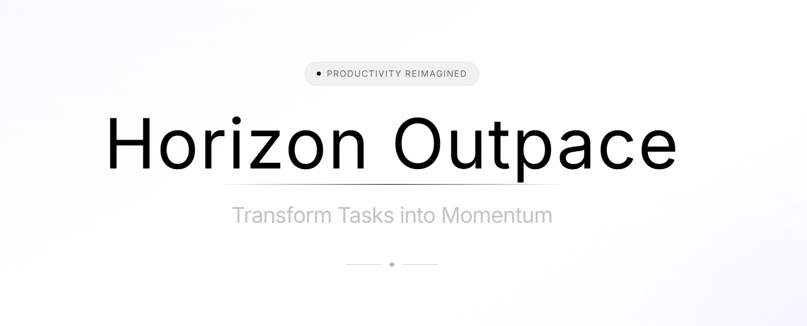

# Horizon Outpace

> Transform Tasks into Momentum

A modern, AI-powered task management application featuring a stunning glassmorphism UI with liquid glass effects.

## ✨ Features

- **AI-Powered Intelligence** - Machine learning algorithms analyze your workflow patterns and optimize task prioritization
- **D3.js Visualizations** - Dynamic, interactive data visualizations for productivity metrics
- **Intelligent Automation** - Smart automation that learns from your behavior
- **Predictive Analytics** - AI-driven insights to predict bottlenecks and suggest optimal task sequences
- **Performance Tracking** - Real-time analytics with advanced metrics
- **Enterprise Security** - Bank-level encryption and privacy controls

## 🛠️ Tech Stack

### Frontend
- **Framework:** Next.js 16
- **UI:** React 19, Tailwind CSS 4
- **Animations:** GSAP
- **Icons:** Lucide React
- **Language:** TypeScript

## 🚀 Getting Started

### Prerequisites
- Node.js 18+ or Bun
- npm, yarn, or bun

### Installation

1. Clone the repository
```bash
git clone https://github.com/TechTitan360/Horizon-Outpace.git
cd Horizon-Outpace
```

2. Install frontend dependencies
```bash
cd frontend
npm install
# or
bun install
```

3. Run the development server
```bash
npm run dev
# or
bun dev
```

4. Open [http://localhost:3000](http://localhost:3000) in your browser

## 📁 Project Structure

```
Horizon-Outpace/
├── frontend/
│   ├── app/
│   │   ├── components/
│   │   │   ├── hero.tsx
│   │   │   └── feature.tsx
│   │   ├── page.tsx
│   │   ├── layout.tsx
│   │   └── globals.css
│   ├── public/
│   ├── package.json
│   └── tsconfig.json
├── Backend/
├── README.md
└── .gitignore
```

## 🎨 Design

The UI features a premium **liquid glass morphism** design with:
- Multi-layered translucent backgrounds
- Animated gradient orbs with mouse tracking
- Glass shine and reflection effects
- Noise texture overlays for realistic glass appearance
- Smooth GSAP animations

## 📝 License

This project is private.

## 👤 Author

**TechTitan360**

---

<p align="center">Built with ❤️ using Next.js and React</p>
